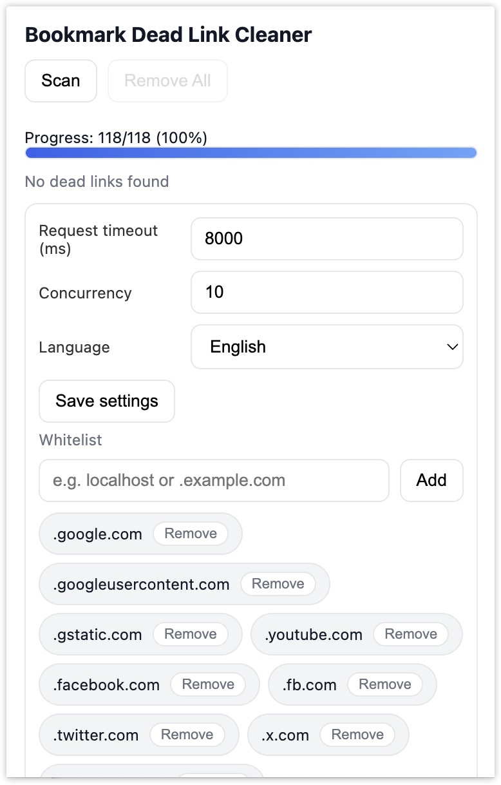

# 书签死链清理器（Bookmark Dead Link Cleaner）

扫描全部书签，检测死链并一键清理。支持检测 HTTP 错误、超时、域名到期或不存在，提供白名单。



## 使用
- 在 Chrome 打开 `chrome://extensions`，开启“开发者模式”→“加载已解压的扩展程序”→选择仓库根目录
- 点击扩展图标打开弹窗，点击 Scan 扫描并查看结果

## 特性
- 一键扫描，实时进度与当前站点 favicon
- 原因标签：HTTP Error、Timeout、Network Error、Local、Domain Not Found、Expired
- 单项移除 / 一键移除；支持精确与后缀白名单（如 `.example.com`）
- 可配置请求超时与并发；中英双语界面

## 隐私与权限
- 本地运行，不收集、传输或出售任何个人数据
- 权限：`bookmarks`、`storage`、`<all_urls>` 仅用于连通性校验
- 隐私政策：见 `docs/privacy.html` 或商店页面链接

## 打包
```bash
bash scripts/pack.sh
```

## 发行
- 推送 `v*` 标签自动打包并发布 Release（见 GitHub Actions 配置）

## 贡献
- 提交规范：中文前缀类型（feat/fix/docs/style/refactor/perf/test/chore），首行不超过 72 字符
- 详情见 `CONTRIBUTING.md`

## 许可
MIT